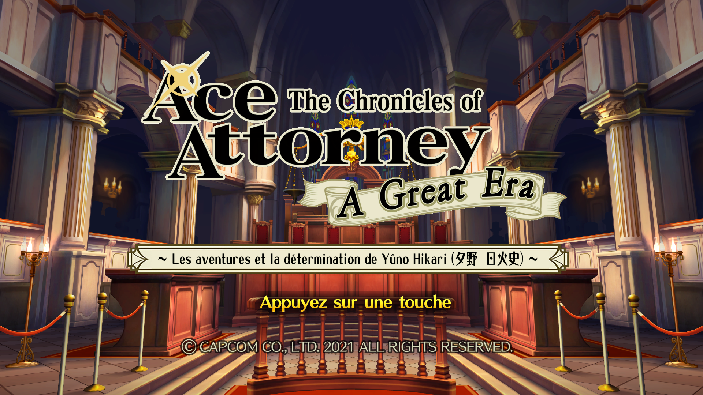

# The Chronicles of Ace Attorney: A Great Era
Traduction française de Dai Gyakuten Saiban (The Great Ace Attorney Chronicles) pour la Nintendo 3DS, Steam et la Nintendo Switch. Pour toute question, problème, ou simplement pour discuter du jeu, rejoignez [le Discord](https://discord.gg/a4tFRwU8).

## Contenu du patch
### 3DS :
Le premier jeu est intégralement traduit.
### HD (Steam, Switch) :
Le premier jeu est traduit (cinq premières affaires). Tout le contenu spécial est également traduit.
## Patcher le jeu
Vous pouvez retrouver le dernier patch [juste ici](https://github.com/AAI-fr/DGS-FR/releases).
Récupérez le patcheur de votre système d'exploitation ainsi que le fichier .aapatch de la version que vous souhaitez patcher. Lancez le patcheur, sélectionnez le patch, regardez les instructions ci-dessous, et suivez les indications du patcheur.

À noter que le patcheur nécessite des versions de systèmes d'exploitations récentes. Nous essaierons de travailler sur une meilleure compatibilité dans le futur. En cas de problème, n'hésitez pas à nous contacter.

## Instructions
### Nintendo 3DS :
#### Prérequis :
- Une Nintendo 3DS hackée.
- Une ROM japonaise du jeu déchiffrée (.cia ou .3ds). L'ID du jeu est 000400000014AD00.
<!-- - Une ROM DLC japonaise du jeu déchiffrée (.cia, facultative mais fortement recommandée). -->

Une fois le patch terminé, vous devriez voir la ROM patchée au format .cia dans le même dossier que le patcheur. Mettez-la sur la carte SD de votre 3DS et installez-la avec FBI.

<!--
**IMPORTANT** : si vous comptez jouer au DLC, il faut également suivre les étapes suivantes :

 1. Récupérez le fichier luma.zip (qui se trouve avec les patches).
 2. Extrayez-le sur la carte SD de votre 3DS de sorte à ce que les dossiers 0004008C0F14AD00 et 000400000F14AD00 se trouvent dans le dossier luma/titles (en partant de la racine de la carte SD)
 3. Lancez le menu luma en allumant votre console tout en appuyant sur SELECT. Si ce n'est pas déjà fait, cochez "Enable game patching", puis "Save and exit".
 
Si en lançant le menu des DLCs, vous êtes renvoyé(e) sur l'écran titre, revérifiez les étapes 2 et 3.

-->

Note : les ROMs patchées ont un ID unique, donc elles ne risquent pas de rentrer en conflit avec d'autres versions du jeu.

### Steam :
#### Prérequis :
- Le jeu installé. Si vous êtes sur Windows et avez installé le jeu sans choisir un emplacement, il devrait déjà être reconnu.

Une fois le patch terminé, vous pouvez simplement lancer le jeu, qui sera en français.

### Nintendo Switch :
#### Prérequis :
- Une Nintendo Switch hackée.
- Les clefs de déchiffrements du firmware de la Switch (fichier souvent appelé prod.keys).
- Une ROM du jeu (.nsp), que ce soit la version japonaise ou la version internationale. (Note : la version japonaise n'a été que très peu testée).

Une fois le patch terminé, vous trouverez un dossier 010036e00fb20000 dans le même dossier que le patcheur. Copiez-le dans le dossier atmosphere/contents de votre carte SD. Si vous jouez avec la version japonaise, renommez le dossier en 0100d7f00fb1a000.

## Doublage

Il n'y a pas de doublage français en jeu, mais nous avons implémenté un doublage dit "immersif", qui utilise les voix japonaises et anglaises selon la situation. La seule exception est quelques interjections dans l'affaire 1 du premier jeu qui sont toujours en anglais à cause de limitations techniques.

## Bugs et problèmes connus

### 3DS

- Dans certains cas, le texte de l'historique disparaît. Nous ne pourrons très certainement jamais corriger ça, mais si besoin, sauvegarder puis charger la partie fait réapparaître le texte.

- Certains textes défilent très lentement lors des déductions.

## Crédits

**Chef de projet** : Choky

**Traduction** : Choky, N0vatique

**Romhack, programmation, outils** : Aclios, Benji99

**Graphismes** : Alexane B., Jau, Kikoro, N0vatique, Tolita, Tox, Aclios, Choky

**Tests et relectures** : Alexandre Ad, Alexane B., Aude-Amélie T.
Aurel_Hunty, Joe Monsters, Gunchap, Ned, Alexis TGF, Mellma,
Ronano, Aclios, n0vatique, Mondher, Magaster

**Doublage** : Kirill Morunov

**Jaquettes et manuels** : Anthiflo, Tolita

**Remerciements** : Scarlet Study pour le travail effectué sur les formats du jeu, Ace Attorney Worldwide, Mr.LeoNov.